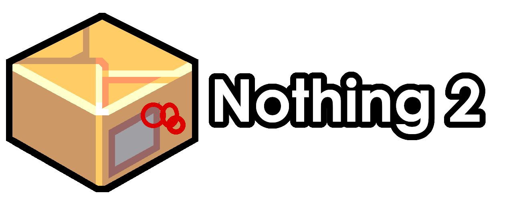

# [Nothing 2](https://banszky.itch.io/nothing-2) - Download

## 

[Production Build 32bit](https://drive.google.com/uc?export=download&id=1VunlHdGlP1WWVY7cjaIxeYe7e8myBy1D)

[Development Build 32bit](https://drive.google.com/uc?export=download&id=1cezxd3TISR1FUoL4pU_KndJyW_CNQVBE)

[Old Build 32bit](https://drive.google.com/uc?export=download&id=1z3CCYZG-KJSq7IZhFYGwOgxaGcqUlqqP)

## 
[Production Build](https://drive.google.com/uc?export=download&id=1RuGHoBuaJfxvAyN8qt4wSTm2I1HxDgyo)

[Development Build](https://drive.google.com/uc?export=download&id=1JbSARRQTIC-hUAqwC5Au_TGizp1FzSgP)

## 
> ⚠ I have **not tested** whether it works at all on this platform. I just built it for that too.
> 
[Production Build](https://onedrive.live.com/download?cid=6AEB0DA011C539BF&resid=6AEB0DA011C539BF%2153953&authkey=AO3BX-CNR5RWxCI)
